# Current Progress Overview

Currently main routes include:

- `/molecules` 
- `/drugs` 

These routes support basic CRUD operations(drugs is missing update).

Additionally, molecules support substructure search and file upload.

Everything is synchronous.

# Database Schema

Molecule groups are not implemented yet.

Pay attention to relationship types of the crow foot notation.

For example, we have 1:n relationship between molecules and drug_molecules because a drug should have at least one molecule.

There is 0:n relationship between molecules and drug_molecules because a molecule can be in 0 or more drugs and so on.

Molecule groups will be added soon.


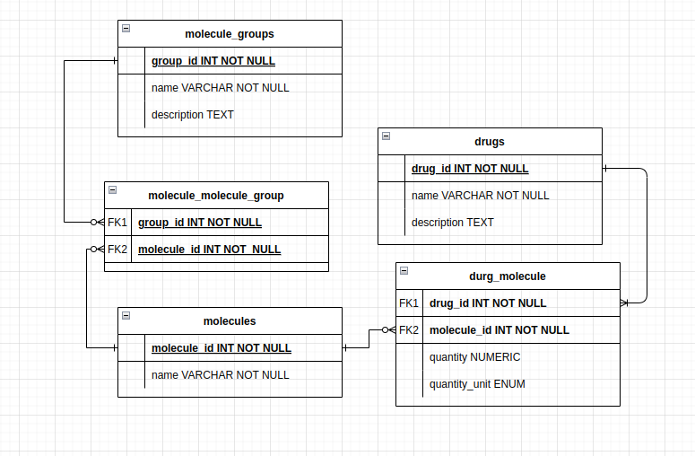


# API Documentation

Get all routes support pagination with `page` and `pageSize` query parameters.

There are certain kind of operations, for which just getting a certain number of results makes more
sense than paginating through all results. 
When you encounter a `limit` query parameter, it is used to limit the number of results returned.

You will see `Links` object in the response body, which contains links to related resources, 
and it is used for HATEOAS.

HATEOAS is implemented as a dictionary of links, where the key is the relation type, 
and the value is a dictionary containing the `href` and `method` fields. These links come
with the response body, and they are used to navigate through the API.

HATEOAS is not fully implemented. You can not get every kind of operation available for a resource,
you just get the most useful ones. For example self, superstructures, substructures links are provided for molecules.
If you want to update a molecule, you will just send a PUT request to the self link.

## Molecules  

Endpoints and DTO for molecules.


### Endpoints `/molecules`

I decided to support both substructure and superstructure search.

Here the term `superstructure` refers to a molecule that the given molecule is a substructure of.
For example, if `C` is a substructure of `CC`, then `CC` is a superstructure of `C`.

I am not sure if this is the correct terminology, but it is the most simple and intuitive way
I can describe it. 


    - POST: Create a new molecule

    - DELETE: /{molecule_id} Delete a molecule by id

    - PATCH: /{molecule_id} Update a molecule by id, only name can be updated

    - POST: /upload Upload a csv file containing molecules info

    - GET: /{molecule_id} Get a molecule by id

    - GET: /?page={page}&pageSize={pageSize}&name={name}&minMass={minMass}&maxMass={maxMass}
            &order={order}&orderBy={orderBy} 

        Get a collection of molecules with optional query parameters
        order: asc or desc
        orderBy: name or mass

    - GET: /search/substructures?smiles={smiles}?limit={limit} Search for a molecule by substructure
    
    - GET: /search/superstructures?smiles={smiles}?limit={limit} Search for a molecule by superstructure

### Molecule DTOs

These are the data transfer objects, used for request and response bodies.

You can see data types as well as examples for each field.

##### MoleculeRequest: Request body for creating a molecule

    - name: string `Methane`
    - smiles: string `C`

##### MoleculeUpdateRequest: Request body for updating a molecule

Updating smiles and mass does not make sense, so only name can be updated.

    - name: string `Methane`

##### MoleculeResponse: Response body for a molecule
    
    - id: int `1`
    - name: string `Methane`
    - smiles: string `C`
    - mass: float `16.04`
    - links: dict[string, Link] `{
        
        self: {
            href: molecules/{id}
            method: GET
        }

         superstructures: {
            href: molecules/search/superstructures?smiles={smiles}
            method: GET
        }

        substructures: {
            href: molecules/search/substructures?smiles={smiles}
            method: GET
        }
        
    }`

##### MoleculeCollectionResponse: Response body for a collection of molecules

Pay attention, if this is a response from substances search, you will not see pagination attributes
page, pageSize, and links will be empty.


    - total: int `100`
    - page: Optional[int] `1`
    - pageSize: Optional[int] `10`
    - data: List[MoleculeResponse]
    - links: dict[string, Link] `{
        
        nextPage: {
            href: molecules/?page=2&pageSize=10
            method: GET
        }
    
        prevPage: {
            href: molecules/?page=1&pageSize=10
            method: GET
        }

    }`


## Drugs

This is functional but not complete. For example update is missing, does not support different functionalities 
like collective responses, file uploads, and only has basic CRUD operations.  

Tests cover over 90% of the code.

Endpoints and DTO for drugs.

Idea behind drugs is to be able to create a drug with a different combination of molecules, 
it should be possible to indicate the amount of each molecule in the drug.

Drug should have at least one molecule, and a molecule can be in 0 or more drugs.

Currently, only the basic CRUD operations are supported. UPDATE is missing.

### Endpoints `/drugs`

    - POST: Create a new drug

    - DELETE: /{drug_id} Delete a drug by id

    - GET: /{drug_id} Get a drug by id

    - GET: /?page={page}&pageSize={pageSize}

        Get a collection of drugs with pagination

### Drug DTOs

These are the data transfer objects, used for request and response bodies.


#### DrugRequest: Request body for creating a drug

Request body for creating a drug. It uses another DTO DrugMoleculeRequest to indicate
what molecules are in the drug and their quantities. See that DTO below.

    - name: string `drunkenstein`
    - description: string `Crazy drug for gopniks`
    - molecules: List[DrugMoleculeRequest] `[
        {
            moleculeId: int `1`
            quantity: float `95`
            quantityUnit: string `ML`
        },
        {
            moleculeId: int `2`
            quantity: float `5`
            quantityUnit: string `ML`
        }
    ]`


#### DrugMoleculeRequest:

This is nevery used directly, it is used in DrugRequest to indicate what molecules are in the drug.
QuantityUnit is either molar(mol) or volume(ML) or mass(G). This makes sense because different molecules
can have different units.

    - moleculeId: int `1`
    - quantity: float `95`
    - quantityUnit: string `ML`

#### DrugResponse: Response body for a drug
    
    - id: int `1`
    - name: string `drunkenstein`
    - description: string `Crazy drug for gopniks`
    - molecules: List[DrugMoleculeResponse] `[
        {
            moleculeId: int `1`
            quantity: float `95`
            quantityUnit: string `ML`
        },
        {
            moleculeId: int `2`
            quantity: float `5`
            quantityUnit: string `ML`
        }
    ]`
    - links: {}


# Redis and performance

Now let's look at how and at what extend I improved performance and what techniques I use.

Before we move on to caching, lets look at what else I use for performance.

## Costly queries overview

There is also a drugs endpoint but functionality is not so much interesting yet.  So I will discuss only molecules.

Here are some of the things that takes time:

- Getting a collection of molecules with pagination, ordering and filtering by molecular mass, and fuzzy search by name
by trigram algorithm.
- 
basically, this endpoint:
    
        - GET: /?page={page}&pageSize={pageSize}&name={name}&minMass={minMass}&maxMass={maxMass}
                &order={order}&orderBy={orderBy} 

The reasons why this is endpoint slow is: 1. database has to do a lot of work. 2. Converting data to Pydantic models is slow.
Actually, the slowest part is converting data to Pydantic models, depending on the number of results, if the number of results is
large, then it becomes main bottleneck.


- Substructure and Superstructure searches are also slow 
    
        - GET: /search/substructures?smiles={smiles}?limit={limit} Search for a molecule by substructure

Reason is also database work and converting data to Pydantic models, plus, to check if a molecule is a substructure of another molecule,
we have to **convert smiles to rdkit molecule object**, which is actually the slowest part:
            
    for molecule in find_all:
        if mol.HasSubstructMatch(Chem.MolFromSmiles(molecule.smiles)):
            ... then it is substructure, this is slow


## How to improve performance

Lets see what I did to make things faster.

I will do demos for the most costly queries. 

### Setup

#### Middleware for logging request processing time

I Have middleware in `src/middleware.py` that logs the time it takes to process a request. We will look
at that.


#### testing data

For testing, I will use the simplest organic compounds "Alkanes" as molecules. I also used them nearly in every 
test I made, they are amazing. Let's generate file of first 500 alkanes and upload it with the endpoint.

    - POST: /molecules/upload Upload a csv file containing molecules info

The file is generated by src/molecules/tests/generate_alkanes.py::generate_large_csv_file

Generates `500alkanes.csv` under the base directory. 

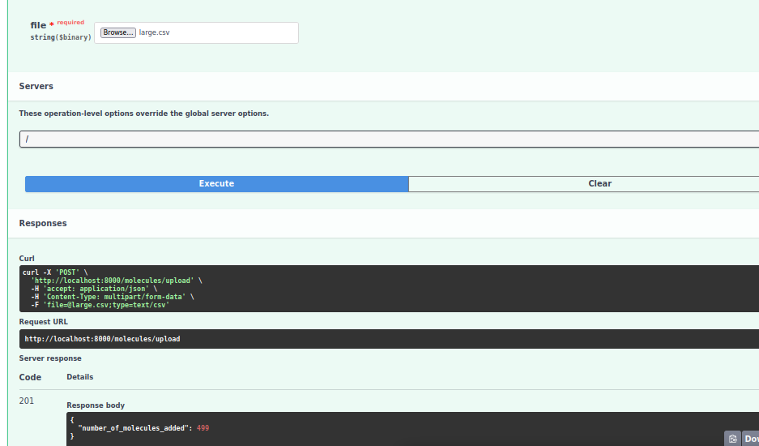


Now we have 499 alkanes in the database plus 3 molecules that come default when the app is started in development mode.


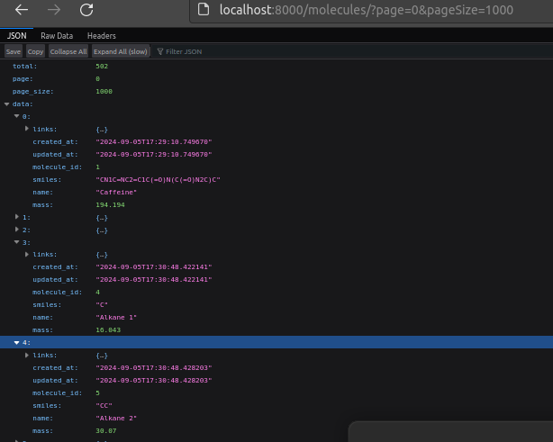


But you know what, this 500 molecules is nice quantity for substructure search, but not
enought for database performance testing. So I will generate 10000 alkanes with bulk insert.

    - POST: /molecules/upload?validate=False Upload a csv file containing molecules info without validation bulk insert

This will populate the database with 10000 alkanes.

Lets upload 10000 alkanes and see how long it takes.

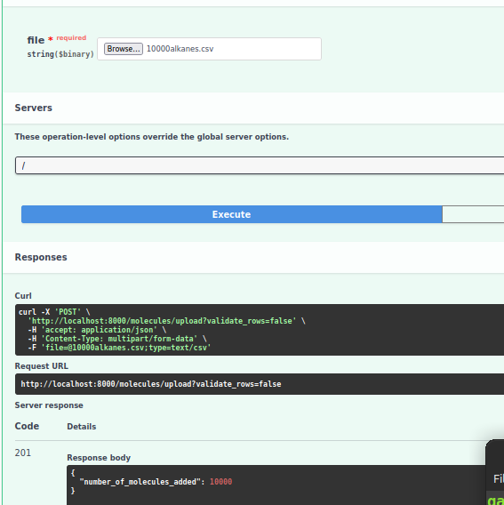

It took just 6 seconds 


### Indexing

#### Setup sample data

Thing about indexes I learned from working on this project is that, they do not matter unless you have really
a large amount of data, I mean really large. I tried filters and sorts with 30k, 50, 100k alkanes in my database,
and when I run sql script with `EXPLAIN ANALYZE` I see that query is still executed in milliseconds, with 
indexes it is 5 times faster, but still, it is milliseconds. So my previous data with 10000 alkanes is not enough.
Instead to really demonstrate performance benefits 
what I do is I generate 3 * 10**6 alkanes completely randomly and inserted them into the database.

Script fot this is in **src/molecules/tests/play.py**

Smiles are generated randomly, maximum length of carbon chain is 300, so I had to drop the unique constraint
just for testing purpose. See alembic migration `src/alembic/versions/a7f5f6d8308a_drop_molecule_unique_smiles_for_testing.py`

So, there are 3 * 10**6 alkanes in the database.

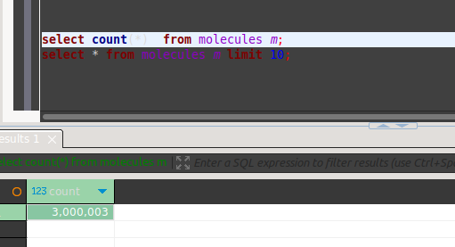

Those first 3 molecules are default molecules that come with the app when it is started in development mode.
Caffeine, Surcose, and Water, rest of them are alkanes

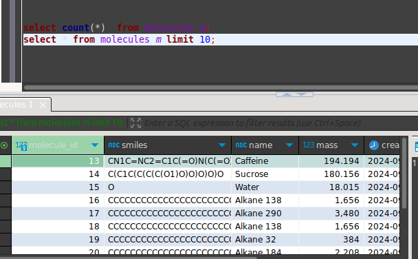


#### Queries to test

Now I will run queries with 3 * 10**6 alkanes in the database.

  
  **Q1. Mass filtering and ordering**

     - GET: /?page={50}&pageSize={5}minMass={100}&maxMass={200}
                &order={desc}&orderBy={mass}


  **Q2. fuzzy search "water"**

     - GET: /?page={0}&pageSize={5}&name={water}


#### Making requests

I will not make requests from the browser, I will use curl and not wait for the response,
I am not interested in the response, I am interested in the time it takes to process the request.

Example request:

    - curl -s "http://localhost:8000/molecules?page=50&pageSize=5&minMass=100&maxMass=200&order=desc&orderBy=mass" > /dev/null


#### Results Before Indexing

As you can see there are no indexes, we are at the alembic version "drop_molecule_unique_smiles_for_testing"

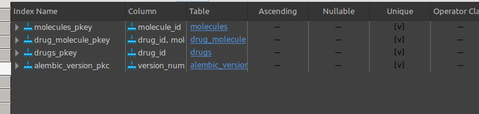

After I ran the queries, I updated the alembic version to "add_indexes_to_molecules" and ran the queries again.
As you can see, there are indexes now.

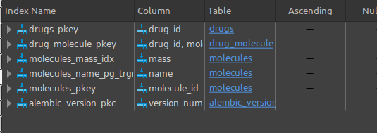

##### Q1

    - curl -s "http://localhost:8000/molecules/?page=0&pageSize=5&minMass=100&maxMass=200&order=desc&orderBy=mass" > /dev/null
    
**Before indexing, Average time: 0.21 seconds**

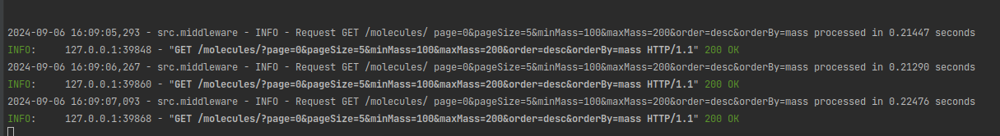


**After indexing, Average time: 0.004 seconds, 500 times faster!!!!!**

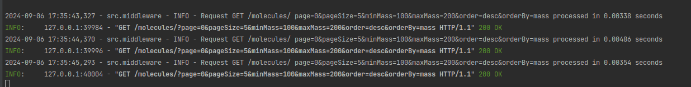

##### Q2

    - curl -s "http://localhost:8000/molecules/?page=0&pageSize=5&name=alkane" > /dev/null

**Before indexing, Average time: 3.34 seconds**


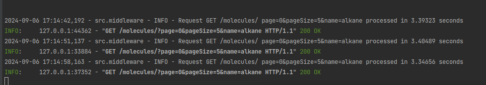

**After indexing, Average time: 3.5 seconds :(**

No improvement despite indexing, I think because I not only search, I sort by similarity too, see implementation
of fuzzy search in `src/molecules/repository.py`. But no, I also checked on name="wter", there is only one result on this,
still it took the same time 0.05 seconds. I don't know what is the problem, maybe trigram index is not implemented well

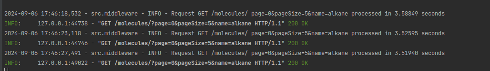


##### Conclusion on indexing

Indexes are good for filtering and sorting by mass, its also supposed to be good for fuzzy search, but I probably implemented
it wrong.  Where indexes can not help is if user askes for very large result sets at once,
because then the bottleneck is converting data to Pydantic models, I saw this but did not show here.

### Caching rdkit Chem objects

  Another thing I did to improve performance is caching rdkit Chem objects. This becomes useful when we do substructure
and superstructure searches as I said. 

#### Pros

Redis makes it possible to cache responses, but you can only cache against a certain key, for a certain smiles string.
If you cache smiles CC, then after requesting for CCC you will not get the cached result, because the key is different.

But if you cache rdkit Chem objects, you only need to cache once, you create rdkit objects once, which is the slowest part,
then for every subsequent request, you just get the object from the cache, which is very fast, and as we will see
below, it makes every request 100 times faster!!!

#### Cons

But the problem is if the server restarts cache is lost, 
  or we are using multiple instances of the server and load is distributed, by let's say Round robin, which I am currently using, then the cache is not shared, 
so this might not be the best solution but still, impact it can have 

#### Implementation

Before, whenever I needed Chem object, I would create it from smiles, but now I cache them in OrderedDict,
which is LRU cache from collections module. I cache 1000 objects, when the cache is full, 
I remove the least recently used object. This is necessary not to run out of memory.

```python

class ChemService:
    DEFAULT_CACHE_SIZE = 1000

    def __init__(self, cache_size: int = DEFAULT_CACHE_SIZE):
        self._cache_size = cache_size
        self._cache = OrderedDict()

    def get_chem(self, smiles: str):
        if smiles in self._cache:
            return self._cache[smiles]

        mol = get_chem_molecule_from_smiles_or_raise_exception(smiles)
        if len(self._cache) >= self._cache_size:
            self._cache.popitem(last=False)
        self._cache[smiles] = mol
        return mol
        
# Exporting a singleton instance of ChemService as a dependency
@lru_cache
def get_chem_service():
    return ChemService()

```

Whenever I need a Chem object, I will import get_chem_service and call `get_chem_service().get_chem(smiles)`


#### Setup Sample Data

  I will use that 500 alkanes and complete database model, including indexes and unique constraints.
    
  I in ChemService, I will overwrite the cache size to 1, so I will not cache anything and run the queries.

  Then I will set the cache size to 1000 and run the queries again.


#### Making requests

Now I can make requests from the browser, Result set is not that large.

I will make three request for *Substructure search* and three requests for *Superstructure search* and take average time.
I will make different requests for each query, to show that only certain requests are not cached, and every subsequent request
is cached, no matter what the smiles is.

**Before caching, Average time: 12 seconds for every request**

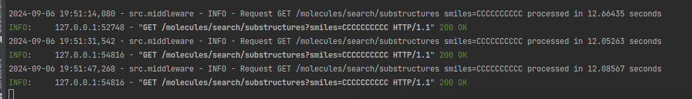

**After caching, first request is slow, but every subsequent request is 0.048 seconds, 250 times faster!!!!!**


##### Q2

    - "http://localhost:8000/molecules/search/superstructures?smiles=C" > /dev/null

**Before caching, Average time: 12 seconds**

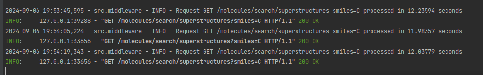

**after caching, first request is slow, but every other request is hunreds of times faster!!!! 0.01-0.05 seconds**

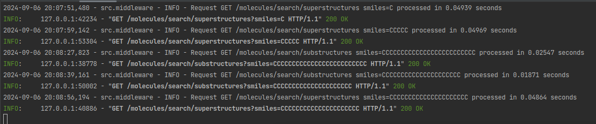


##### Conclusion on caching rdkit Chem objects

Caching rdkit Chem objects is very effective, you just cache one request
and it makes every subsequent hundreds of times faster, regardless of the smiles string(One thing here is that
if the smiles strings are too big, then the the actual similarity checking will become bottleneck and not creation 
of chem molecules, but that does not happen unless smiles you are searhing for is of length 300-400).


### Redis 


