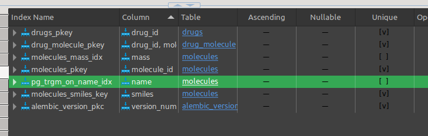

# Current Progress Overview

Currently main routes include:

- `/molecules` 
- `/drugs` 

These routes support basic CRUD operations(drugs is missing update).

Additionally, molecules support substructure search and file upload.

Everything is synchronous.

# Database Schema

Molecule groups are not implemented yet.

Pay attention to relationship types of the crow foot notation.

For example, we have 1:n relationship between molecules and drug_molecules because a drug should have at least one molecule.

There is 0:n relationship between molecules and drug_molecules because a molecule can be in 0 or more drugs and so on.

Molecule groups will be added soon.

# API Documentation

Get all routes support pagination with `page` and `pageSize` query parameters.

There are certain kind of operations, for which just getting a certain number of results makes more
sense than paginating through all results. 
When you encounter a `limit` query parameter, it is used to limit the number of results returned.

You will see `Links` object in the response body, which contains links to related resources, 
and it is used for HATEOAS.

HATEOAS is implemented as a dictionary of links, where the key is the relation type, 
and the value is a dictionary containing the `href` and `method` fields. These links come
with the response body, and they are used to navigate through the API.

HATEOAS is not fully implemented. You can not get every kind of operation available for a resource,
you just get the most useful ones. For example self, superstructures, substructures links are provided for molecules.
If you want to update a molecule, you will just send a PUT request to the self link.

## Molecules  

Endpoints and DTO for molecules.

### Endpoints `/molecules`

I decided to support both substructure and superstructure search.

Here the term `superstructure` refers to a molecule that the given molecule is a substructure of.
For example, if `C` is a substructure of `CC`, then `CC` is a superstructure of `C`.

I am not sure if this is the correct terminology, but it is the most simple and intuitive way
I can describe it. 

    - POST: Create a new molecule

    - DELETE: /{molecule_id} Delete a molecule by id

    - PATCH: /{molecule_id} Update a molecule by id, only name can be updated

    - POST: /upload Upload a csv file containing molecules info

    - GET: /{molecule_id} Get a molecule by id

    - GET: /?page={page}&pageSize={pageSize}&name={name}&minMass={minMass}&maxMass={maxMass}
            &order={order}&orderBy={orderBy} 

        Get a collection of molecules with optional query parameters
        order: asc or desc
        orderBy: name or mass

    - GET: /search/substructures?smiles={smiles}?limit={limit} Search for a molecule by substructure
    
    - GET: /search/superstructures?smiles={smiles}?limit={limit} Search for a molecule by superstructure

### Molecule DTOs

These are the data transfer objects, used for request and response bodies.

You can see data types as well as examples for each field.

##### MoleculeRequest: Request body for creating a molecule

    - name: string `Methane`
    - smiles: string `C`

##### MoleculeUpdateRequest: Request body for updating a molecule

Updating smiles and mass does not make sense, so only name can be updated.

    - name: string `Methane`

##### MoleculeResponse: Response body for a molecule
    
    - id: int `1`
    - name: string `Methane`
    - smiles: string `C`
    - mass: float `16.04`
    - links: dict[string, Link] `{
        
        self: {
            href: molecules/{id}
            method: GET
        }

         superstructures: {
            href: molecules/search/superstructures?smiles={smiles}
            method: GET
        }

        substructures: {
            href: molecules/search/substructures?smiles={smiles}
            method: GET
        }
        
    }`

##### MoleculeCollectionResponse: Response body for a collection of molecules

Pay attention, if this is a response from substances search, you will not see pagination attributes
page, pageSize, and links will be empty.

    - total: int `100`
    - page: Optional[int] `1`
    - pageSize: Optional[int] `10`
    - data: List[MoleculeResponse]
    - links: dict[string, Link] `{
        
        nextPage: {
            href: molecules/?page=2&pageSize=10
            method: GET
        }
    
        prevPage: {
            href: molecules/?page=1&pageSize=10
            method: GET
        }

    }`

## Drugs

This is functional but not complete. For example update is missing, does not support different functionalities 
like collective responses, file uploads, and only has basic CRUD operations.  

Tests cover over 90% of the code.

Endpoints and DTO for drugs.

Idea behind drugs is to be able to create a drug with a different combination of molecules, 
it should be possible to indicate the amount of each molecule in the drug.

Drug should have at least one molecule, and a molecule can be in 0 or more drugs.

Currently, only the basic CRUD operations are supported. UPDATE is missing.

### Endpoints `/drugs`

    - POST: Create a new drug

    - DELETE: /{drug_id} Delete a drug by id

    - GET: /{drug_id} Get a drug by id

    - GET: /?page={page}&pageSize={pageSize}

        Get a collection of drugs with pagination

### Drug DTOs

These are the data transfer objects, used for request and response bodies.

#### DrugRequest: Request body for creating a drug

Request body for creating a drug. It uses another DTO DrugMoleculeRequest to indicate
what molecules are in the drug and their quantities. See that DTO below.

    - name: string `drunkenstein`
    - description: string `Crazy drug for gopniks`
    - molecules: List[DrugMoleculeRequest] `[
        {
            moleculeId: int `1`
            quantity: float `95`
            quantityUnit: string `ML`
        },
        {
            moleculeId: int `2`
            quantity: float `5`
            quantityUnit: string `ML`
        }
    ]`

#### DrugMoleculeRequest:

This is nevery used directly, it is used in DrugRequest to indicate what molecules are in the drug.
QuantityUnit is either molar(mol) or volume(ML) or mass(G). This makes sense because different molecules
can have different units.

    - moleculeId: int `1`
    - quantity: float `95`
    - quantityUnit: string `ML`

#### DrugResponse: Response body for a drug
    
    - id: int `1`
    - name: string `drunkenstein`
    - description: string `Crazy drug for gopniks`
    - molecules: List[DrugMoleculeResponse] `[
        {
            moleculeId: int `1`
            quantity: float `95`
            quantityUnit: string `ML`
        },
        {
            moleculeId: int `2`
            quantity: float `5`
            quantityUnit: string `ML`
        }
    ]`
    - links: {}

# Redis and performance

Now let's look at how and at what extend I improved performance and what techniques I use.

Before we move on to caching, lets look at what else I use for performance.

## Costly queries overview

There is also a drugs endpoint but functionality is not so much interesting yet.  So I will discuss only molecules.

Here are some of the things that takes time:

- Getting a collection of molecules with pagination, ordering and filtering by molecular mass, and fuzzy search by name
by trigram algorithm.
- 
basically, this endpoint:
    
        - GET: /?page={page}&pageSize={pageSize}&name={name}&minMass={minMass}&maxMass={maxMass}
                &order={order}&orderBy={orderBy} 

The reasons why this is endpoint slow is: 1. database has to do a lot of work. 2. Converting data to Pydantic models is slow.

- Substructure and Superstructure searches are also slow 
    
        - GET: /search/substructures?smiles={smiles}?limit={limit} Search for a molecule by substructure

Reason is also database work and converting data to Pydantic models, plus, to check if a molecule is a substructure of another molecule,
we have to **convert smiles to rdkit molecule object**, which is actually the slowest part:
            
    for molecule in find_all:
        if mol.HasSubstructMatch(Chem.MolFromSmiles(molecule.smiles)):
            ... then it is substructure, this is slow

## How to improve performance

Lets see what I did to make things faster.

I will do demos for the most costly queries. 

### Setup

#### Middleware for logging request processing time

I Have middleware in `src/middleware.py` that logs the time it takes to process a request. We will look
at that.

#### testing data

For testing, I will use the simplest organic compounds "Alkanes" as molecules. I also used them nearly in every 
test I made, they are amazing. Let's generate file of first 500 alkanes and upload it with the endpoint.

    - POST: /molecules/upload Upload a csv file containing molecules info

The file is generated by src/molecules/tests/generate_alkanes.py::generate_large_csv_file

Generates `large.csv` under the base directory. 

Now we have 499 alkanes in the database plus 3 molecules that come default when the app is started in development mode.

But you know what, this 500 molecules is nice quantity for substructure search, but not
enought for database performance testing. So I will generate 10000 alkanes with bulk insert.

    - POST: /molecules/upload?validate=False Upload a csv file containing molecules info without validation bulk insert

This will populate the database with 10000 alkanes.

Lets upload 10000 alkanes and see how long it takes.

It took just 6 seconds 

### Indexing

For this, I will use bulk insert to insert 10000 alkanes.

I created gist trigram index on the name column of the molecules table. This speeds up the fuzzy search by name.

I created btree index(default in postgres) on the mass column of the molecules table. 
This speeds up the ordering by mass and filtering by mass.

As you can see there is no index:

Now lets test the request:

    - http://localhost:8000/molecules/?page=0&pageSize=15000&minMass=20&maxMass=50000&orderBy=mass&order=desc

There is filtering and soring and request for  15000 molecules. as I can see from the terminal, it took 21 seconds.
and 22 seconds from the second time

and the second request is for trigram search by name:

    - http://localhost:8000/molecules/?page=0&pageSize=27000&name=Alkane

First request took 21 seconds, second request took 18 seconds as I can see from the terminal.

Now lets create indexes and see how it affects the performance. after upgrading migration

### Caching rdkit Chem objects

    
