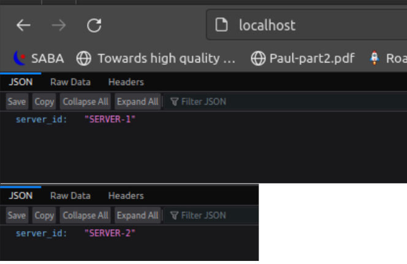

# Dockerfile

This is a simple Dockerfile, consisting of 7 layers. 

First we have base layer which is the miniconda3 image.

Second layer is to copy the environment file to the docker image. 

Third layer is to create the environment.
These layer is the most time consuming, so it is better to have it as soon as possible.

Fourth layer is to set the working directory to /app.

Fifth layer is to copy the source code to the docker image.
This copies only the source code, not the tests, or cache files, as .dockerignore file is set to ignore them.

Last two layers are created by ENTRYPOINT and CMD commands.

I can't think of a way to reduce the number of layers, to effectively reduce the image size,
or to reorganize the layers to make better sense.
Also, I don't see that this image fits the multi-stage build pattern, as conda environment is fully necessary,
and the source code is not compiled.

Notice that instead of activating the environment(which I struggled with, and maybe it's not possible at all), 
I used conda run command to run the fastapi app.
**Let me know if there is a better way to do this.**


```dockerfile
# base image +1 layer
FROM continuumio/miniconda3

LABEL maintainer="GT <suiiii@gmail.com>"
LABEL description="Docker image for fastapi in memory molecules crud"

# copy the environment file to the docker image + 1 layer
# this file is generate by conda env export
COPY environment.yml .

# create the environment and  name it environment + 1 layer
RUN conda env create -f environment.yml  -n environment

# working directory + 1 layer
WORKDIR /app

# copy the source code to the docker image + 1 layer
COPY /src /app/src

# expose the port 8000
EXPOSE 8000

# conda run is the main executable, maybe I should have heft only conda in entrypoint? idk
# --no-capture-output is for showing fasapi app logs in the termial when container runs
ENTRYPOINT [ "conda", "run" ]
CMD ["--no-capture-output", "-n", "environment", "fastapi", "dev", "--host", "0.0.0.0", "--port", "8000", "src/main.py"]

```

# Load Balancing

Almost the same way as the homework hint, I used the docker-compose and nginx to set things up. Just a few changes.

I created a separate bridge network for the services, just not to use the default network.

```yaml

version: '3.8'
services:
  web1:
    build: .
    environment:
      SERVER_ID: SERVER-1
    networks:
      - webnet

  web2:
    build: .
    environment:
      SERVER_ID: SERVER-2
    networks:
      - webnet

  nginx:
    image: nginx:latest
    ports:
      - "80:80"
    volumes:
      - ./nginx:/etc/nginx/conf.d
    depends_on:
      - web1
      - web2
    networks:
      - webnet

networks:
  webnet:
    driver: bridge
```

I copy/pasted the nginx configuration from the homework hint and added the test endpoint.

Let's see:


And the result on localhost:80



## Problem

Now, since I was using the in memory database, that I have implemented,
the data is not shared between the two instances of the app.

### Possible Solutions

- Configure nginx to use load balancing only on get requests, and delegate the post requests to both instances.
- Create a http repository server and implement the Repository class to use it.
- Use a real database, like redis and create tmpfs volume to share the data between the instances.

I wanna try to implement all of them. Any reccomendations?
